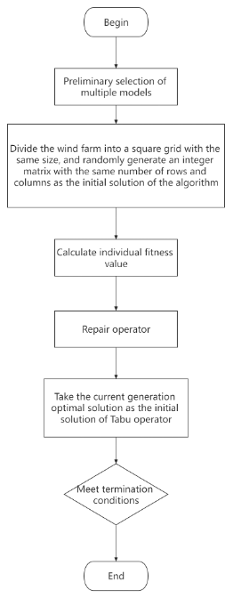

# Optimization of wind farm scheduling based on traditional genetic algorithm
 
## usage

### install

  pip install numpy pandas

### run
  python main.py --instance_all 1

### result
  Save in the result.txt in the current directory after running

### Genetic Algorithm Based Optimal Arrangement Method of Multi type Fans in Wind Farm
##### steps
- 1)The wind farm area is divided into square grids of equal size according to the wind turbine diameter, and the integer matrix of the same row and column is randomly generated as the initial solution of the algorithm ;
- 2)Calculate the individual fitness value of the current generation ;
- 3)Over uniform random selection operator selects parent individuals participating in crossover, and then uses improved crossover mutation operator to generate child individuals ;
- 4)Introducing repair operators to individuals in the population;
- 5)Tabu operator is introduced to the current generation optimal solution of the population, and the optimal solution is taken as the initial solution of Tabu algorithm to search the neighborhood solution of the optimal solution ;
- 6)Judge whether the maximum number of iterations is reached. If yes, complete the optimal layout of multi model fans, otherwise return to step 2)
### flow chart

