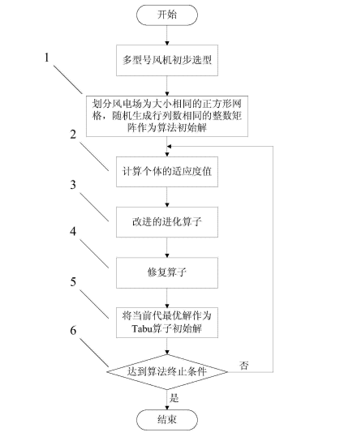

# 基于传统遗传算法的风电场调度优化问题
 
## 使用方法

### 安装

  pip install numpy pandas

### 运行
  python main.py --instance_all 1

### 结果
  运行结束后保存在当前目录下的result.txt中

### 基于遗传算法的风电场多型号风机优化排布方法
##### 步骤
- 1)根据风机直径将风电场区域划分成大小相等的正方形网格，随机生成相同行列的整数矩阵作为算法的初始解 ;
- 2)计算当前代的个体适应度值 ;
- 3)通过均匀随机选择算子选择参与交叉的父代个体,再利用改进的交叉变异算子生成子代个体 ;
- 4)对种群中的个体引入修复算子;
- 5)对种群当前代最优解引入Tabu 算子,将该最优解作为 Tabu 算法的初始解，搜索最优解的邻域解 ;
- 6)判断是否达到最大的迭代次数,若为是,则完成多型号风机优化排布，否则返回步骤2)
### 流程图
